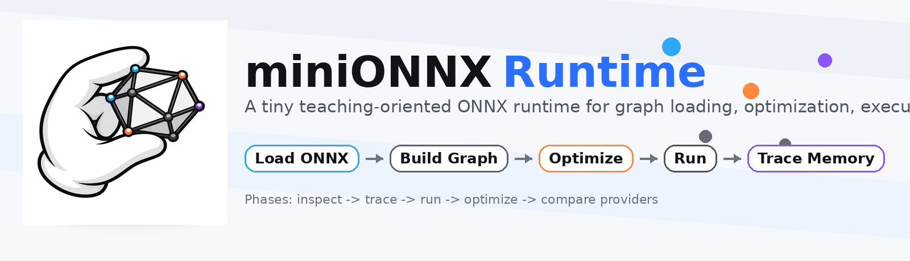

# miniONNXRuntime

A teaching-oriented mini implementation of ONNX Runtime.
It now follows three teaching tracks:

- `yolov8n.onnx`: visual-model parsing, optimization, execution, and basic memory optimization
- GPT-2 ONNX graphs: prompt encoding, greedy generation, provider execution, and `KV cache`
- Qwen2.5-0.5B ONNX graphs: baseline/KV-cache inference on a larger text model and provider-path comparison



Chinese version: [README.md](./README.md)

## Environment

Build requirements:

- CMake 3.20+
- A C++20-capable compiler
- Protobuf
  - `protoc` is required
  - CMake first tries `find_package(Protobuf CONFIG QUIET)` and then falls back to CMake's built-in `FindProtobuf`

The repository already includes `third_party/onnx`, so no extra ONNX source download is needed.

## Install Dependencies

### Linux

If you want to use the repository's setup script to prepare dependencies, run:

```bash
# Automatically checks and installs cmake / protobuf / protoc
./scripts/setup_linux_env.sh
```

The script tries the following in order:

- `conda-forge`
- falls back to `apt-get` when `conda` is not available

If you prefer manual install on Ubuntu / Debian:

```bash
sudo apt update
sudo apt install -y build-essential cmake git libprotobuf-dev protobuf-compiler
```

### macOS

On macOS, install the Homebrew dependencies:

```bash
brew install cmake protobuf git
```

## What It Shows

- Parse ONNX graph
- Optimize graph structure
- Run CPU / Apple provider kernels
- Trace tensor memory and buffer reuse

## Quick Start

After dependencies are installed, the build/run flow is the same on Linux and macOS:

```bash
# enable optimizer tools so phase4 is available
cmake -S . -B build_local -DMINIORT_BUILD_OPTIMIZER_TOOLS=ON

# build all tools
cmake --build build_local -j4

# phase1: inspect the static graph first
./scripts/run_phase.sh phase1

# phase3: run end-to-end CPU inference
./scripts/run_phase.sh phase3

# phase4: compare the graph before and after optimization
./scripts/run_phase.sh phase4-opt

# phase5: compare provider paths
./scripts/run_phase.sh phase5

# phase6: GPT-2 macOS baseline
./scripts/run_phase.sh phase6

# phase6-kv: GPT-2 KV cache + macOS provider
./scripts/run_phase.sh phase6-kv

# phase7: Qwen KV cache (default)
./scripts/run_phase.sh phase7
```

If you only want to build and test first:

```bash
./scripts/run_phase.sh build
./scripts/run_phase.sh test
```

If you want to go through the whole teaching flow in order:

```bash
./scripts/run_phase.sh all
```

Notes:

- `all` currently covers the default teaching flow: `phase1 -> phase5`
- text-model phases (`phase6` / `phase6-kv` / `phase7`) are optional and require local model assets

## Learning Path

| Phase | Focus | Command | Read more |
| --- | --- | --- | --- |
| `phase1` | static graph structure | `./scripts/run_phase.sh phase1` | [ZH](./docs/phases/phase1.md) / [EN](./docs/phases/phase1.en.md) |
| `phase2` | minimal execution pipeline | `./scripts/run_phase.sh phase2` | [ZH](./docs/phases/phase2.md) / [EN](./docs/phases/phase2.en.md) |
| `phase3` | end-to-end CPU inference | `./scripts/run_phase.sh phase3` | [ZH](./docs/phases/phase3.md) / [EN](./docs/phases/phase3.en.md) |
| `phase4` | graph optimization and memory tracing | `./scripts/run_phase.sh phase4-opt` / `phase4-memory` | [ZH](./docs/phases/phase4.md) / [EN](./docs/phases/phase4.en.md) |
| `phase5` | `ExecutionProvider` abstraction and provider comparison | `./scripts/run_phase.sh phase5` | [ZH](./docs/phases/phase5.md) / [EN](./docs/phases/phase5.en.md) |
| `phase6` | GPT-2 macOS provider baseline | `./scripts/run_phase.sh phase6` | [ZH](./docs/phases/phase6.md) / [EN](./docs/phases/phase6.en.md) |
| `phase6-kv` | GPT-2 KV cache + macOS provider | `./scripts/run_phase.sh phase6-kv` | [ZH](./docs/phases/phase6.md) / [EN](./docs/phases/phase6.en.md) |
| `phase7` | Qwen KV-cache inference (default) | `./scripts/run_phase.sh phase7` | [ZH](./docs/phases/phase7.md) / [EN](./docs/phases/phase7.en.md) |

## Main Entry Points

| Tool | Best for | Typical use |
| --- | --- | --- |
| `miniort_inspect` | graph structure, inputs/outputs, op histogram | first look at a model |
| `miniort_session_trace` | how the first nodes execute and how values flow | learning the minimal execution pipeline |
| `miniort_run` | full inference timing and summary | validating end-to-end execution |
| `miniort_memory_trace` | live tensors, peak bytes, release timing | understanding memory and lifetime |
| `miniort_optimize_model` | graph before/after optimization | phase4 walkthrough |
| `miniort_compare_providers` | default provider vs CPU-only | phase5 walkthrough |
| `miniort_detect_yolov8n` | final detections and output files | demo output |
| `miniort_run_gpt` (GPT-2) | GPT-2 text generation and KV-cache inference | understanding GPT-2 execution |
| `miniort_run_qwen` (Qwen) | Qwen KV-cache inference | understanding Qwen execution |
| `tools/chat_web_demo.py` (Qwen) | simple chat webpage backed by `miniort_run_qwen` | quick Qwen chat demo |

## Download Models

Since the model files are large, they cannot be uploaded directly to GitHub. Please run the following script to download all required models:

```bash
./scripts/download_models.sh
```

This will download the GPT-2 model to the `models/gpt2/` directory and the additional model to the `models/` directory. After downloading, you can run the related phases.

## GPT Entry

**Note: Before running GPT-2 related phases, please run `./scripts/download_models.sh` to download all models.**

- `./scripts/run_phase.sh phase6`
- `./scripts/run_phase.sh phase6-kv`

Please download the models first (see above).

## Qwen Entry (Optional)

The Qwen flow is an optional teaching track (not part of the default phase1~6 path in `run_phase.sh`).

- Bring-up doc: `docs/phase7_qwen_inference_bringup.md`
- Example config: `examples/qwen2_5_0_5b/kv_generate.cfg`

Notes:

- Qwen ONNX/weight files are large, so model binaries (for example `.onnx` / `.safetensors`) are ignored by default via `.gitignore`.
- Prepare model assets locally and export ONNX before running.

Common scripts:

- baseline export: `scripts/export_qwen_onnx.py`
- KV prefill/decode export: `scripts/export_qwen_kv_onnx.py`
- INT8 quantization: `scripts/export_qwen_int8_onnx.py`

Run examples:

```bash
# phase7 (default KV-cache path)
./scripts/run_phase.sh phase7

# direct binary call (KV-cache config)
./build_local/miniort_run_qwen --config examples/qwen2_5_0_5b/kv_generate.cfg
```

## Repository Layout

```text
miniONNXRuntime
├── include/ / src/   # core runtime, loader, optimizer, and tool implementation
├── tools/            # command-line entrypoints
├── models/ / pic/    # local demo model and image assets
├── docs/             # user-facing documentation
├── notes/            # drafts, experiment logs, internal notes
└── scripts/          # environment setup and unified build/run entrypoints
```
