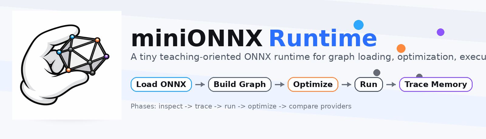

# miniONNXRuntime

A teaching-oriented mini implementation of ONNX Runtime.
It now follows three teaching tracks:

- `yolov8n.onnx`: visual-model parsing, optimization, execution, and basic memory optimization
- GPT-2 ONNX graphs: prompt encoding, greedy generation, provider execution, and `KV cache`
- Qwen2.5-0.5B ONNX graphs: parsing, optimization, execution, and basic memory optimization on a larger text model



Chinese version: [README.md](./README.md)

## Environment

Build requirements:

- CMake 3.20+
- A C++20-capable compiler
- Protobuf
  - `protoc` is required
  - CMake first tries `find_package(Protobuf CONFIG QUIET)` and then falls back to CMake's built-in `FindProtobuf`

The repository already includes `third_party/onnx`, so no extra ONNX source download is needed.

## Install Dependencies

### Linux

If you want to use the repository's setup script to prepare dependencies, run:

```bash
# Automatically checks and installs cmake / protobuf / protoc
./scripts/setup_linux_env.sh
```

The script tries the following in order:

- `conda-forge`
- falls back to `apt-get` when `conda` is not available

If you prefer manual install on Ubuntu / Debian:

```bash
sudo apt update
sudo apt install -y build-essential cmake git libprotobuf-dev protobuf-compiler
```

### macOS

On macOS, install the Homebrew dependencies:

```bash
brew install cmake protobuf git
```

## Download Models

Since model files are large, they are not committed to GitHub. Run:

```bash
# check which local files are still missing
./scripts/download_models.sh status

# prepare only the assets you need, or run all
./scripts/download_models.sh yolo
./scripts/download_models.sh gpt2
./scripts/download_models.sh qwen
```

The unified entry supports:

- YOLOv8n: downloads `models/yolov8n.onnx`
- GPT-2 KV: prepares prefill/decode ONNX and tokenizer files under `models/gpt2/`
- Qwen2.5-0.5B KV: prepares prefill/decode ONNX and tokenizer files under `models/qwen2_5_0_5b_instruct/`

Qwen ONNX files are large. The script uses `gdown` for the current shared folder when available; you can also place
the files manually or export them from a local checkpoint with `scripts/export_qwen_kv_onnx.py`. See
[models/README.md](./models/README.md) for the exact file contract.
If you use the default Google Drive archives for GPT-2/Qwen, install `gdown` first: `python -m pip install gdown`.

## Quick Start

After dependencies are installed, the build/run flow is the same on Linux and macOS:

```bash
# enable optimizer tools so phase4 is available
cmake -S . -B build_local -DMINIORT_BUILD_OPTIMIZER_TOOLS=ON

# build all tools
cmake --build build_local -j4

# phase1: inspect the static graph first
./scripts/run_phase.sh phase1

# phase3: run end-to-end CPU inference
./scripts/run_phase.sh phase3

# phase4: compare the graph before and after optimization
./scripts/run_phase.sh phase4-opt

# phase5: compare provider paths
./scripts/run_phase.sh phase5

# phase6: GPT-2 baseline
./scripts/run_phase.sh phase6

# phase6-kv: GPT-2 KV cache
./scripts/run_phase.sh phase6-kv

# phase7: Qwen KV cache (default)
./scripts/run_phase.sh phase7
```

If you only want to build and test first:

```bash
./scripts/run_phase.sh build
./scripts/run_phase.sh test
```

If you want to go through the whole teaching flow in order:

```bash
./scripts/run_phase.sh all
```

Note: `all` currently covers the default flow `phase1 -> phase5`. Text-model phases (`phase6` / `phase6-kv` / `phase7`) require model download first.

To run a phase on a CUDA device, enable the CUDA ExecutionProvider build. This uses the current CUDA path, including
the CUDA optimizations described below:

```bash
MINIORT_BUILD_CUDA_EP=ON CMAKE_BUILD_TYPE=Release BUILD_DIR=build_cuda_release \
  ./scripts/run_phase.sh phase7
```

Without `MINIORT_BUILD_CUDA_EP=ON`, `run_phase.sh` uses the normal CPU/default build.

## Current Results

These numbers were measured locally on the same machine with an NVIDIA GeForce RTX 4090. YOLOv8n uses
`mean / p50 latency (ms)`, while GPT-2 and Qwen use `tokens/s`, with generation / prefill latency kept in
parentheses for context. YOLOv8n now supports running the fused `ConvSiLU` graph path on CUDA; the table uses
`--optimal` as the default benchmark setup.

| Model / workload | Benchmark args | MiniORT CPU | MiniORT CUDA | ORT CPU | ORT CUDA |
| --- | --- | --- | --- | --- | --- |
| YOLOv8n | `--optimal` | `84.089 / 82.115 ms` | `4.219 / 4.211 ms` | `33.679 / 36.564 ms` | `1.86 / 1.86 ms` |
| GPT-2 KV cache | `--optimal` | `about 27.83 tokens/s` (generation mean `1724.52 ms`, prefill mean `136.64 ms`) | `about 227.40 tokens/s` (generation mean `422.16 ms`, prefill mean `11.13 ms`) | `about 83.46 tokens/s` (generation mean `1150.24 ms`, prefill mean `16.54 ms`) | `about 438.65 tokens/s` (generation mean `218.85 ms`, prefill mean `1.80 ms`) |
| Qwen2.5-0.5B KV cache | `--optimal` | `about 7.97 tokens/s` (generation mean `1004.04 ms`, prefill mean `110.25 ms`) | `about 61.65 tokens/s` (generation mean `129.77 ms`, prefill mean `15.16 ms`) | `about 15.45 tokens/s` (generation mean `517.85 ms`, prefill mean `52.98 ms`) | `about 171.36 tokens/s` (generation mean `46.68 ms`, prefill mean `4.75 ms`) |

Optimization record:

- [CUDA optimizations](./docs/optimization_summary.md)

## Learning Path

| Phase | Focus | Command | Read more |
| --- | --- | --- | --- |
| `phase1` | static graph structure | `./scripts/run_phase.sh phase1` | [ZH](./docs/phases/phase1.md) / [EN](./docs/phases/phase1.en.md) |
| `phase2` | minimal execution pipeline | `./scripts/run_phase.sh phase2` | [ZH](./docs/phases/phase2.md) / [EN](./docs/phases/phase2.en.md) |
| `phase3` | end-to-end CPU inference | `./scripts/run_phase.sh phase3` | [ZH](./docs/phases/phase3.md) / [EN](./docs/phases/phase3.en.md) |
| `phase4` | graph optimization and memory tracing | `./scripts/run_phase.sh phase4-opt` / `phase4-memory` | [ZH](./docs/phases/phase4.md) / [EN](./docs/phases/phase4.en.md) |
| `phase5` | `ExecutionProvider` abstraction and provider comparison | `./scripts/run_phase.sh phase5` | [ZH](./docs/phases/phase5.md) / [EN](./docs/phases/phase5.en.md) |
| `phase6` | GPT-2 baseline text generation | `./scripts/run_phase.sh phase6` | [ZH](./docs/phases/phase6.md) / [EN](./docs/phases/phase6.en.md) |
| `phase6-kv` | GPT-2 KV-cache inference | `./scripts/run_phase.sh phase6-kv` | [ZH](./docs/phases/phase6.md) / [EN](./docs/phases/phase6.en.md) |
| `phase7` | Qwen KV-cache inference | `./scripts/run_phase.sh phase7` | [ZH](./docs/phases/phase7.md) / [EN](./docs/phases/phase7.en.md) |

## Main Entry Points

| Tool | Best for | Typical use |
| --- | --- | --- |
| `miniort_inspect` | graph structure, inputs/outputs, op histogram | first look at a model |
| `miniort_session_trace` | how the first nodes execute and how values flow | learning the minimal execution pipeline |
| `miniort_run` | full inference timing and summary | validating end-to-end execution |
| `miniort_memory_trace` | live tensors, peak bytes, release timing | understanding memory and lifetime |
| `miniort_optimize_model` | graph before/after optimization | phase4 walkthrough |
| `miniort_compare_providers` | default provider vs CPU-only | phase5 walkthrough |
| `miniort_detect_yolov8n` | final detections and output files | demo output |
| `miniort_run_gpt` (GPT-2) | GPT-2 text generation and KV-cache inference | understanding GPT-2 execution |
| `miniort_run_qwen` (Qwen) | Qwen KV-cache inference | understanding Qwen execution |
| `tools/chat_web_demo.py` (Qwen) | simple chat webpage backed by `miniort_run_qwen` | quick Qwen chat demo |

## Text Model Entry (GPT / Qwen)

Run `./scripts/download_models.sh status` first, then prepare only the missing model track.

- GPT-2: `./scripts/run_phase.sh phase6` / `./scripts/run_phase.sh phase6-kv`
- Qwen (default KV cache): `./scripts/run_phase.sh phase7`

For more Qwen details:

- `docs/phases/phase7.en.md`
- `docs/optimization_summary.md`
- `examples/qwen2_5_0_5b/kv_generate.cfg`

Run examples:

```bash
# phase7 (default KV-cache path)
./scripts/run_phase.sh phase7

# direct binary call (KV-cache config)
./build_local/miniort_run_qwen --config examples/qwen2_5_0_5b/kv_generate.cfg
```

## Repository Layout

```text
miniONNXRuntime
├── include/ / src/   # core runtime, loader, optimizer, and tool implementation
├── tools/            # command-line entrypoints
├── models/ / pic/    # local demo model and image assets
├── docs/             # user-facing documentation
├── notes/            # drafts, experiment logs, internal notes
└── scripts/          # environment setup and unified build/run entrypoints
```
