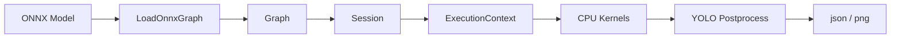

# miniONNXRuntime

一个围绕 `yolov8n.onnx` 的 C++ mini runtime，用来说明 ONNX 模型如何被加载、优化和执行。



## Current Status

当前已经完成：

- ONNX 模型解析与内部图构建
- `Session` / `ExecutionContext` / `KernelRegistry`
- CPU 侧基础 kernels
- 真实图片输入和 YOLO 检测输出
- 执行 profiling
- phase4 图优化入口

当前还会继续做：

- `ShapeSimplification`
- 更完整的图优化 pass
- `ExecutionProvider` 抽象
- buffer reuse / 内存优化
- 更通用的模型支持

## Quick Start

```bash
cmake -S . -B build_phase3 -DMINIORT_BUILD_OPTIMIZER_TOOLS=OFF
cmake --build build_phase3 -j4
cmake -S . -B build_phase4 -DMINIORT_BUILD_OPTIMIZER_TOOLS=ON
cmake --build build_phase4 -j4
./build_phase3/miniort_detect_yolov8n models/yolov8n.onnx --image pic/bus.jpg --profile
./build_phase4/miniort_optimize_model models/yolov8n.onnx --image pic/bus.jpg --profile
```

## Phase Overview

- `phase1`
  - 纯解析
  - 主要是模型解析、图结构和属性检查
- `phase2`
  - 加入 `Session`
  - 形成最小执行主线，但还不强调完整检测输出
- `phase3`
  - 加入各个算子的 CPU 实现
  - 跑通 `yolov8n.onnx` 推理和检测输出
- `phase4`
  - 在 phase3 基础上增加图优化入口
  - 当前已经接入第一版 `ConstantFolding` / `DeadNodeCleanup`

## Repository Layout

```text
include/miniort/
  loader/          ONNX loader 对外接口
  model/           Graph / Node / Value / TensorInfo
  runtime/         Session / Tensor / ExecutionContext / KernelRegistry
  optimizer/       图优化入口
  tools/           图像与 YOLO 后处理工具接口

src/
  loader/          ONNX protobuf -> 内部 Graph
  runtime/         执行器与 builtin kernels
  optimizer/       图优化实现
  tools/           输入预处理与 YOLO 后处理

tools/
  miniort_inspect        静态查看图结构
  miniort_session_trace  查看执行主线和 value 流转
  miniort_run            使用真实输入跑整图
  miniort_detect_yolov8n 导出检测结果和可视化
  miniort_optimize_model  优化图后再跑 YOLO
```

## Tool Arguments

### `miniort_inspect`

```bash
./build_phase1/miniort_inspect models/yolov8n.onnx --show-topology 8 --show-initializers 5
```

- `--show-topology N`
  - 显示前 `N` 个拓扑节点
- `--show-initializers N`
  - 显示前 `N` 个 initializer
- `--filter-op OpType`
  - 只看指定算子

适合 `phase1`：纯解析、看图结构。

### `miniort_session_trace`

```bash
./build_phase3/miniort_session_trace models/yolov8n.onnx --max-nodes 16
```

- `--max-nodes N`
  - 只跑前 `N` 个节点
- `--strict-kernel`
  - 遇到未注册算子直接报错
- `--quiet`
  - 关闭逐节点输出

适合 `phase2` / `phase3`：看执行主线和中间值流转。

### `miniort_run`

```bash
./build_phase3/miniort_run models/yolov8n.onnx --image pic/bus.jpg
```

- `--image path`
  - 输入图片路径
- `--max-nodes N`
  - 只跑前 `N` 个节点
- `--verbose`
  - 输出更详细 trace

适合 `phase3`：跑完整推理主线。

### `miniort_detect_yolov8n`

```bash
./build_phase3/miniort_detect_yolov8n models/yolov8n.onnx --image pic/bus.jpg
```

- `--image path`
  - 输入图片路径，必填
- `--save-vis out.png`
  - 保存可视化图片
- `--dump-json out.json`
  - 保存检测结果 JSON
- `--score-threshold 0.25`
  - 过滤低分框
- `--iou-threshold 0.45`
  - NMS 阈值
- `--profile`
  - 打印阶段耗时

适合 `phase3`：看最终检测结果和性能基线。

### `miniort_optimize_model`

```bash
./build_phase4/miniort_optimize_model models/yolov8n.onnx --image pic/bus.jpg --profile
```

- `--image path`
  - 输入图片路径
- `--profile`
  - 打印图优化和运行耗时
- `--verbose`
  - 输出更详细 trace
- `--strict-kernel`
  - 遇到未注册算子直接报错

适合 `phase4`：先优化图，再跑同一套 YOLO 后处理。
