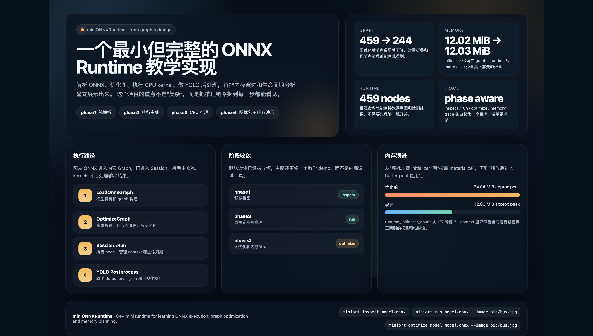

# miniONNXRuntime

一个面向教学的 ONNX Runtime 迷你实现。
它围绕 `yolov8n.onnx` 演示模型如何被解析、优化、执行，以及如何做基础内存优化。



英文版说明见 [README.en.md](./README.en.md)。

## 环境要求

构建前需要：

- CMake 3.20+
- 支持 C++20 的编译器
- Protobuf
  - 需要 `protoc`
  - CMake 会优先尝试 `find_package(Protobuf CONFIG QUIET)`，失败时回退到系统自带的 `FindProtobuf`

项目自带了用于解析 ONNX 的 `third_party/onnx`，不需要额外单独下载 ONNX 代码。

### Ubuntu / Debian

如果你在 Linux 上，先装这些基础包：

```bash
sudo apt update
sudo apt install -y build-essential cmake git libprotobuf-dev protobuf-compiler
```

如果你的系统里已经装过 `cmake`，只想补齐其余依赖，也可以单独执行：

```bash
sudo apt install -y build-essential git libprotobuf-dev protobuf-compiler
```

如果你还没有装 `cmake`，也可以单独先装它：

```bash
sudo apt install -y cmake
```

### macOS

如果你在 macOS 上，先装 Homebrew 依赖：

```bash
brew install cmake protobuf git
```

如果你已经装过 `cmake`，也可以只补齐剩余依赖：

```bash
brew install protobuf git
```

## 这个项目展示什么

- 解析 ONNX 图
- 优化图结构
- 执行 CPU kernels
- 跟踪 tensor 内存和 buffer reuse

## 当前进展

- ONNX 模型解析与内部图构建
- `Session` / `ExecutionContext` / `KernelRegistry`
- CPU 侧基础 kernels
- 真实图片输入和 YOLO 检测输出
- 图优化入口和第一版优化 pass
- 内存观测、initializer 按需 materialize 和 buffer reuse 演示

内存优化的整理版说明在 [docs/blog_memory_optimization.md](./docs/blog_memory_optimization.md)。

## 快速开始

```bash
cmake -S . -B build_phase3 -DMINIORT_BUILD_OPTIMIZER_TOOLS=OFF
cmake --build build_phase3 -j4
./build_phase3/miniort_run models/yolov8n.onnx --image pic/bus.jpg

cmake -S . -B build_phase4 -DMINIORT_BUILD_OPTIMIZER_TOOLS=ON
cmake --build build_phase4 -j4
./build_phase4/miniort_optimize_model models/yolov8n.onnx --image pic/bus.jpg
```

## Phase

- `phase1`: 只看图结构
- `phase2`: 看最小执行主线
- `phase3`: 跑通 CPU 推理
- `phase4`: 看图优化和内存优化
  - 没有单独的 `phase5`，内存优化就是 `phase4` 的一部分

## 主要工具

- `miniort_inspect`: 只看图结构
- `miniort_session_trace`: 看执行和 value 流转
- `miniort_run`: 跑整图推理
- `miniort_memory_trace`: 看内存和张量生命周期
- `miniort_detect_yolov8n`: 导出检测结果
- `miniort_optimize_model`: 优化图后再跑 YOLO
