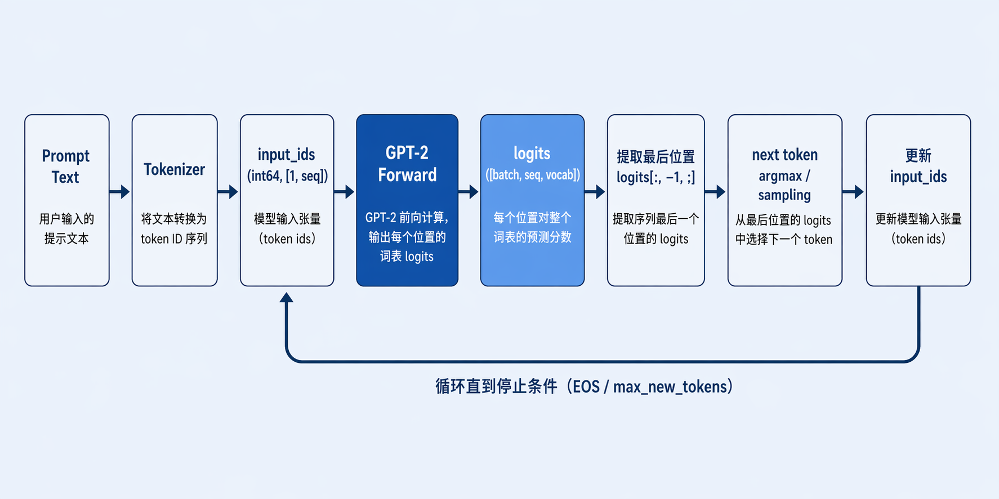
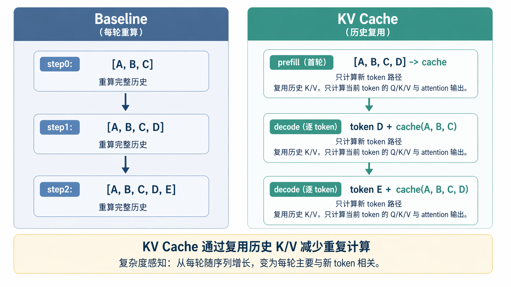
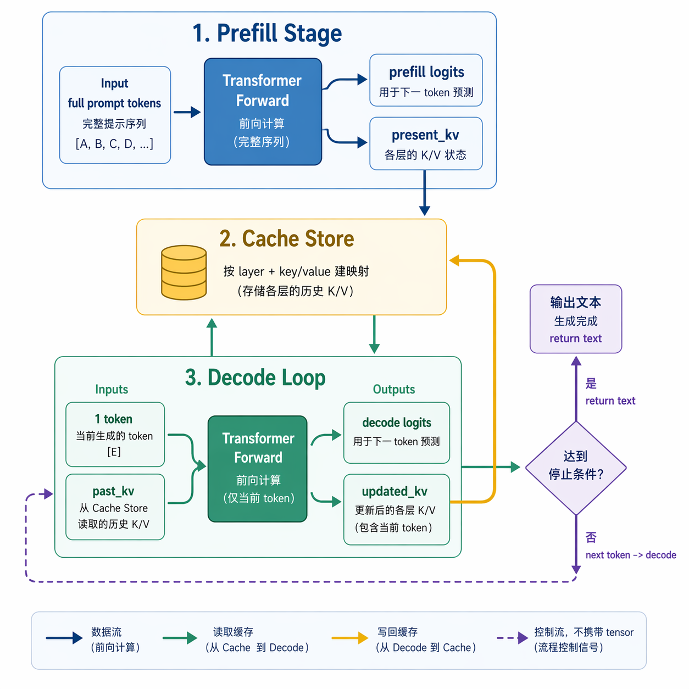
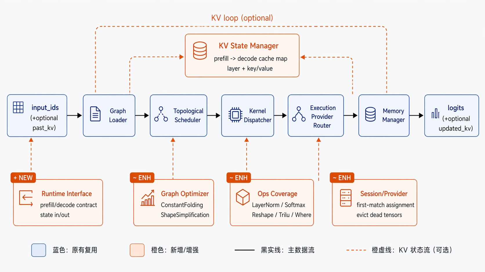

# 从 YOLO 到 GPT-2：miniONNXRuntime 如何把续写模型跑起来

很多同学先从视觉模型进入推理框架。视觉模型通常是一轮前向计算，输入图片，输出分类或检测结果。

GPT-2 的推理形态是循环系统。每一轮只预测一个 next token。模型把这个 token 追加到上下文后继续下一轮。这个循环会持续到停止条件触发，例如达到 EOS 或长度上限。

本文有两个目标：

- 让刚入门的读者真正理解 GPT-2 续写路径。
- 站在 miniONNXRuntime 的实现视角，讲清楚架构、解析、算子和优化。

## 一条最小例子先跑通

我们先看一个最小例子，后文所有概念都围绕它展开。

输入 prompt：`"The sky is"`

1. tokenizer 把文本编码成 token id 序列，例如 `[464, 6766, 318]`（示意值）。
2. 这串 id 变成 `input_ids`，形状通常是 `[1, seq]`。
3. GPT-2 前向输出 `logits`，形状通常是 `[1, seq, vocab]`。
4. 续写时只取最后一个位置 `logits[:, -1, :]`。
5. 从这条向量里选择一个 token，例如 `" blue"` 对应的 id。
6. 把新 id 追加到上下文，继续下一轮。

这个过程就是自回归生成。每一轮依赖之前所有已生成 token。

## token、vocab、input_ids：讲到这里就解释这里

模型不直接处理字符串。模型处理的是数值 tensor。

- `token` 是文本切分后的建模单元。它可以是词、子词、标点、空格相关片段。
- `vocab` 是 token 与整数 id 的映射表。
- `input_ids` 是 token id 序列，常见 dtype 是 `int64`，常见形状是 `[batch, seq]`。

举例：

- 文本：`"Hello world"`
- token 可能是：`["Hello", " world"]`
- id 可能是：`[15496, 995]`

`input_ids` 进入 embedding 层后，离散 id 会映射成连续向量。后续 attention 和 MLP 都在向量空间计算。

## logits：模型输出的是分数，不是概率

`logits` 是 softmax 之前的原始分数。

举例：假设最后一步候选 token 只有 5 个（真实场景是整个词表），分数是：

- `A: 2.1`
- `B: 5.3`
- `C: 1.7`
- `D: -0.3`
- `E: 4.8`

greedy 策略会选分数最高的 `B`。top-k / top-p 会先过滤候选，再做采样。temperature 会改变分布平滑程度。

## baseline 生成路径：每轮重算完整上下文

baseline 的实现很直接。每一轮都把完整上下文重新送入模型。

举例：

- step0 输入 `[A, B, C]`
- step1 输入 `[A, B, C, D]`
- step2 输入 `[A, B, C, D, E]`

每一步都在重复计算历史 token 的 attention 路径。序列越长，重复计算越多。

baseline 的优点是容易验证正确性。它通常是第一版可用实现和后续优化的对照基线。

## KV cache：把历史 K/V 变成可复用状态

self-attention 里每层都会产生 `Q/K/V`。历史 token 的 `K/V` 在下一轮依然有效。

KV cache 的执行逻辑可以用一句话概括：

- 历史 `K/V` 从缓存读取。
- 当前轮只计算新 token 的路径。
- 新生成的 `K/V` 写回缓存。

这个机制直接减少重复计算。长序列场景下收益明显。

## prefill + decode：miniONNXRuntime 的 KV 执行形态

在 miniONNXRuntime 的 GPT-2 路径里，KV cache 采用双图执行：

- `prefill graph`：处理完整 prompt，输出首轮 logits 和初始 cache。
- `decode graph`：每轮输入 `1 token + past_kv`，输出本轮 logits 和 updated_kv。

这里有一个很实用的工程细节。项目没有把层号和 K/V 映射硬编码在配置里。运行时会根据 tensor 名字自动解析层号和 key/value 类型，然后建立 prefill 输出到 decode 输入的绑定关系。这样模型导出命名只要符合约定，映射可以自动建立。

## miniONNXRuntime 架构：从“能跑”到“可分析”

miniONNXRuntime 的 GPT-2 路径可以按 6 层理解。

1. **CLI / Tool 层**
`miniort_run_gpt` 负责参数解析、prompt 编码、生成循环、结果打印。

2. **Loader 层**
ONNX `ModelProto` 会被解析成项目内部 `Graph`。它包含 nodes、inputs、outputs、initializers、value_infos、拓扑序。

3. **Session 层**
Session 负责 provider 分配、kernel 查找、节点执行、summary 汇总。

4. **ExecutionContext 层**
Context 保存当前轮 tensor 状态。它按需 materialize initializer，并管理中间张量生命周期。

5. **Kernel 层**
按 op_type 执行具体算子逻辑。包括 basic、elementwise、nn、shape 四组。

6. **ExecutionProvider 层**
默认 provider 顺序是 CUDA（若可用）-> Accelerate（macOS）-> CPU。节点按首个支持该算子的 provider 分配。

这套分层让你可以分开看“控制流”和“算子计算”。排错效率会高很多。

## GPT-2 在 miniONNXRuntime 里是怎么被解析并执行的

下面按一次推理调用顺序讲解。

### 步骤 1：加载图并构建拓扑顺序

Loader 会读取每个 node 的输入输出边和属性，并构建拓扑顺序。执行阶段直接按这个顺序遍历。

示例理解：

- `MatMul_12` 依赖 `Reshape_7` 的输出。
- `Reshape_7` 必然排在 `MatMul_12` 前面。

### 步骤 2：Session 做 provider 分配

Session 会遍历节点，根据 provider 的 kernel 注册表决定节点落到哪个 provider。分配结果会出现在 `provider assignment summary` 里。

示例理解：

- `MatMul` 如果 CUDA provider 注册了，就优先落 CUDA。
- 某个 op 只有 CPU 有 kernel，就落 CPU。

### 步骤 3：Run 时绑定输入并执行节点

`miniort_run_gpt` 把 `input_ids` 作为 feed 绑定进 context。
Session 依拓扑顺序执行每个节点。每个节点执行后输出 tensor 会写回 context。

### 步骤 4：基于 logits 做 greedy 并进入下一轮

`run_gpt` 从最后位置 logits 选出最大分数 token。这个 token 会被追加或作为下一轮 decode 输入。

### 步骤 5：KV 模式下维护 cache 状态

- prefill 结束后，从 context 读取 prefill 输出 cache，映射成 decode 输入 cache。
- 每次 decode 后，再把 decode 输出 cache 回写到下一轮 decode 输入。

这一步由 `CollectCacheState` 完成。它确保缓存状态在多轮之间连续流动。

## 算子实现：GPT-2 路径重点看哪些

GPT-2 图里最关键的算子可以分三组理解。

### 1) 线性代数核心

- `MatMul`：attention 和 MLP 主干计算。
- `Gemm`：常用于线性层变体。

实现要点：

- 支持 batch 维广播。
- 形状检查严格执行，内维不匹配会直接报错。
- macOS 下可用 Accelerate BLAS，CUDA 下可用 cuBLAS，CPU 有通用实现。

### 2) 归一化与概率

- `LayerNormalization`
- `Softmax`

实现要点：

- `LayerNormalization` 会按 axis 计算 mean/variance，再做缩放和平移。
- `Softmax` 会先做数值稳定处理（减去局部最大值）再指数归一化。

### 3) 形状与序列编排

- `Reshape`、`Transpose`、`Concat`、`Split`、`Slice`
- `Shape`、`Gather`、`Unsqueeze`、`Squeeze`、`Expand`
- `Cast`、`Where`、`Trilu`

实现要点：

- 这类算子决定 attention 的维度拼接和 mask 行为。
- 许多 bug 都来自这里的 shape 不一致，而不是 MatMul 本身。

## 三类优化：模型侧、执行侧、内存侧

### 优化 1：算法级优化（KV cache）

这是 GPT-2 路径最直接的优化。收益来自减少历史 token 重算。

### 优化 2：执行侧优化（provider + kernel）

Session 会优先使用更高性能 provider。常见热点如 `MatMul`、`Gemm` 能显著受益。

### 优化 3：内存侧优化（按需 + 复用）

ExecutionContext 采用按需 materialize initializer。运行时不会把全部初始化权重一次性塞进 context。

另外，CPU allocator 提供了 buffer pool：

- 输出 tensor 可复用已有 buffer capacity。
- 释放的 tensor storage 会回收到池里。

Session 还支持 `evict_dead_tensors`，在张量最后使用点后释放中间值。这个机制可以降低常驻内存峰值。

## 用“实际调试问题”再举两个例子

### 例子 A：生成文本突然重复

常见排查路径：

1. 先看 `last_token_topk`，确认 logits 是否塌陷到极少 token。
2. 再看是否一直在 greedy 且 prompt 太短。
3. KV 模式下检查 cache 绑定是否稳定，层号是否对齐。

### 例子 B：KV 模式首轮正常，后续报 shape 错

常见原因：

- prefill 输出和 decode 输入的某层 K/V rank 不一致。
- decode 轮输入 token 维度不是 `[1,1]`。
- 某个 `Reshape/Transpose` 的维度推导和导出模型不一致。

排查建议：

- 先在 strict 模式下跑，尽早暴露未实现或 shape 不匹配。
- 打开 trace 查看节点输入输出 shape 变化。

## 小结

这篇文章的主线是“从模型原理走到运行时架构”。

你可以用下面四句话记住 miniONNXRuntime 的 GPT-2 路径：

- tokenizer 把文本变成 `input_ids`。
- Session 按拓扑和 provider 执行 ONNX 节点。
- baseline 每轮重算完整上下文，KV cache 复用历史 K/V。
- 性能优化同时发生在算法、执行和内存三个层面。

当你能把这四句和图 1/2/3 对上，GPT-2 在 miniONNXRuntime 里的实现路径就真正打通了。
